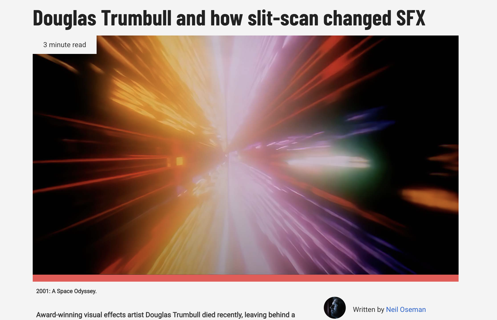
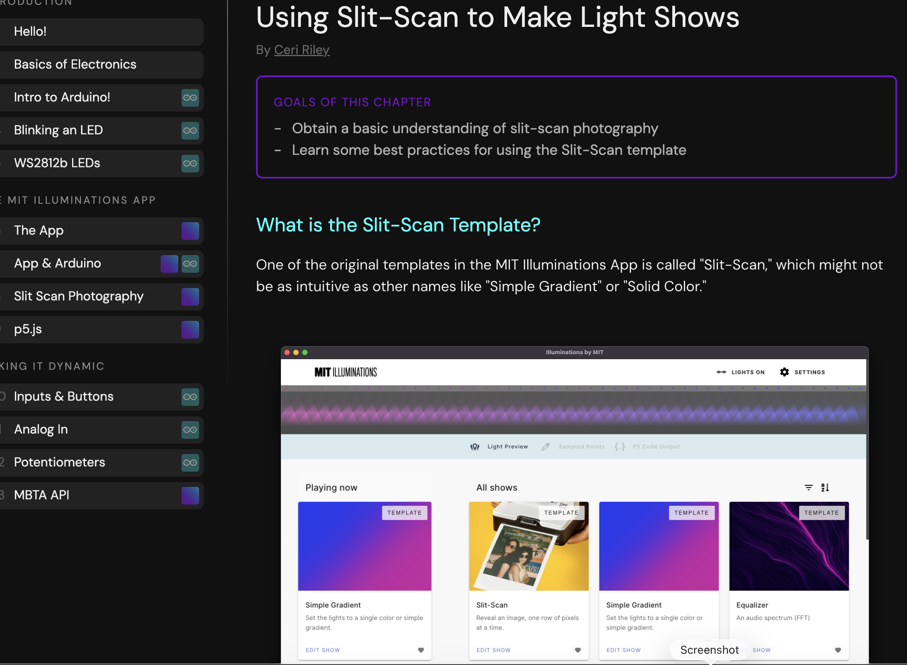
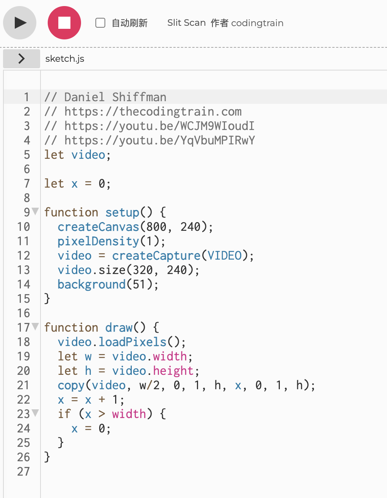

# Quiz 8

## Part 1: Imaging Technique Inspiration

### Chosen technique: Slit-scan imagery  
My inspiration is the slit-scan effect, used in the “Stargate” sequence from *2001: A Space Odyssey*. I want to incorporate its stretched light trails and the way it combines motion and time into one frame. That feels useful for the assignment, because it creates a strong visual impact from simple source material and could make an interactive sketch feel more cinematic, immersive, and experimental. The idea of turning movement into abstract bands of colour is a strong direction for my major project.

*Screenshot reference from* 2001 *slit-scan coverage.*

*Second screenshot showing the colour tunnel / stretched light effect.*

**Sources for screenshots**
- RedShark article on Douglas Trumbull and slit-scan: https://www.redsharknews.com/douglas-trumbull-and-how-slit-scan-changed-sfx
- Optional additional source on the technique: https://learn.illuminations.mit.edu/chapter/slit-scan

---

## Part 2: Coding Technique Exploration

### Coding technique: Video slit-scan with pixel copying in p5.js  
A useful coding technique is slit-scanning a live or recorded video stream by copying a thin vertical slice from each frame and placing it across the canvas over time. This could help me recreate the time-smearing effect from my inspiration while still being achievable in p5.js. Instead of advanced film processing, the sketch builds the image frame by frame using pixel operations, so motion becomes colour bands and distortions. It is a practical way to translate the original visual idea into an interactive coding project.

*Screenshot of a p5.js slit-scan example in action.*

**Example implementation**
- Coding Train explanation: https://thecodingtrain.com/tracks/pixels/pixels/slit-scan/
- Example code in p5.js editor: https://editor.p5js.org/codingtrain/sketches/B1L5j8uk4

---

